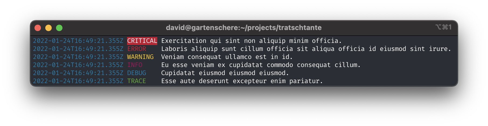

<div id="top"></div>

[![Build][build-shield]][build-url]
[![Coverage][coverage-shield]][coverage-url]
[![Language][language-shield]][build-url]
[![MIT License][license-shield]][license-url]


<br />
<div align="center">
  <a href="https://github.com/hackercowboy/tratschtante">
    
  </a>

<h1 align="center">tratschtante</h1>
  <p align="center">
    Just another logging library for node.js.
  </p>
</div>

## About

`tratschtante` is just another simple logging library for node.js, that just works. 

Every time I wanted to add logging to my node.js application, I didn't know which library to use or everything I found was too cumbersome and too incomprehensive. I just want to write logs with timestamp log level and maybe with some color to the console. 

If you are looking for something simple like this, try this library, if you are looking for something extensive super great, then you should have a look at: [winston](https://github.com/winstonjs/winston).

## Quick Start

```bash
npm install tratschtante 
```

```javascript
const log = require('tratschtante')();

log.info('Hello World!);
```

or 

```bash
yarn add tratschtante 
```

```javascript
import tratschtante from 'tratschtante';

const log = tratschtante();
log.info('Hello World!);
```

## Options
You can pass following options as function parmeter or set them via environment variable:

| name  | environment | default | possibilites |
|---|---|---|---|
| formatter  | TRATSCHTANTE_FORMATTER | 'modern' | 'modern', 'classic', 'json' or custom formatter as function. |
| printer  | TRATSCHTANTE_PRINTER | 'console' | 'console' or custom printer as function. |
| category  | | undefined | any string |
| level | TRATSCHTANTE_LOG_LEVEL, NODE_LOG_LEVEL | 'info' | 'trace', 'debug', 'info', 'waring', 'error', 'critical',|

Example: 

```javascript
const log = require('tratschtante')({ 
  category: 'api',
  printer: 'console',
  formatter: 'json' });

log.info('Hello World!);
```

## Usage
Some code to just see how it works:

```javascript
const log = require('tratschtante')({ 
  category: 'api',
  printer: (entry) => axios.post('http://localhost:3000/log', entry),
  formatter: (entry) => JSON.stringify(entry) });

log.info('Hello World!');

log.debug(() => JSON.stringify({ key: 'value' }));

try {
  throw new Error('Something went wrong');
} catch (error) {
  log.error(error);
}

```

## License

MIT License. See `LICENSE.txt` for more information.


[build-shield]: https://img.shields.io/github/workflow/status/hackercowboy/tratschtante/CI.svg?style=for-the-badge
[build-url]: https://github.com/hackercowboy/tratschtante/actions/workflows/main.yml
[language-shield]: https://img.shields.io/github/languages/top/hackercowboy/tratschtante.svg?style=for-the-badge
[language-url]: https://github.com/hackercowboy/tratschtante
[coverage-shield]: https://img.shields.io/coveralls/github/hackercowboy/tratschtante.svg?style=for-the-badge
[coverage-url]: https://coveralls.io/github/hackercowboy/tratschtante
[license-shield]: https://img.shields.io/github/license/hackercowboy/tratschtante.svg?style=for-the-badge
[license-url]: https://github.com/hackercowboy/tratschtante/blob/master/LICENSE.txt

